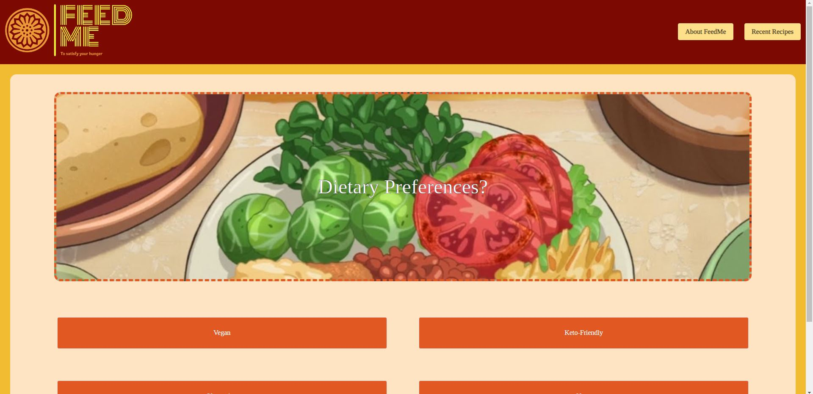

# [Feed-Me (UCSD-Project 1)](https://epicasino.github.io/Feed-Me/)

## User Story

- As a person searching for a recipe,
- I will be presented with a question and different options
- When I click on an option I want
- I will then be presented with another question and options for that question
- When I finish the questions
- I will be presented with recipes based on my answers from the questions
- After reloading the page
- I can access my recent recipes from past results
- If I want a random recipe, I can click on a button
- Then I get redirected to a random recipe

## Acceptance Criteria

It is complete when:

1. There is a question and option box for each question
2. The user can click on an option
3. The question and option values change depending on the question after the user clicks an option
4. The results use an API that gets recipes based on parameters
5. There is a button that gives a random recipe
6. There is a page or something similar that gives me my recent recipes
7. The page is polished and refined

## Description

- A recipe searcher that will give you recipes based on your current hunger needs.
- Using a quiz-style form, you will be presented with three recipes, and their original links, to use for your latest cravings.
- Built using Bulma's CSS Framework and utilizing API's from Edamam, themealdb, and ipapi
- As our first project from complete scratch, team communication and collaboration was key in our success to complete a refined, fully functional application within a week.

## Features

- 3 recipe results based on user feedback on quiz-style form
- Recipe results will always provide a link to the recipe's original website.
- 'Im feeling lucky' button that gives random recipe (or sometimes the recipe for Beef Tea)
- 'Recent recipes' on the right of the navbar gives the recipes that you've recently recieved from past recipe search results after refreshing.
- Past recipes on the 'Recent recipes' section will have a link to click to access the recipe's original website.

## Installation

No installation of files are needed to load the page. Deployment is provided by GitPages. [Click Here To Access.](https://epicasino.github.io/Feed-Me/)

## Usage

**Upon first initializing the website you will be presented with this page.**

**The main part of the application is the quiz-style form to guage your current cravings. The user can click on one of four options. Once the user has decided and clicked on an option, another question will appear along with new options.**

**There is also a 'Feeling Lucky' button that will lead to a random recipe (or lead to Beef Tea).**

**After going through the questions, you will be presented with three recipes based on the options you clicked per question.**

**When clicking on a recipe, you will be presented with a modal with something similar to this.**

**The 'About FeedMe' Button will lead to a modal card.**

**And finally, The 'Recent Recipes' button will lead to a modal containing the recipes you've recieved from past sessions in one area!**

## Credits

**Project Collaborators:**

- [Ray Badua](https://github.com/epicasino)
- [Chelsea Pratte](https://github.com/callmechelsea)
- [Alison Colao](https://github.com/acolao)
- [Martin Navarrete](https://github.com/mavarreteno)

**[CSS Framework by Bulma](https://bulma.io/)**

**[Bulma Modal JS Implementation by Bulma](https://bulma.io/documentation/components/modal/)**

**[Recipe Search API by Edamam](https://developer.edamam.com/edamam-docs-recipe-api)**

**[Random Meal API by TheMealDB](https://www.themealdb.com/)**

**[Location API by ipapi](https://ipapi.co/)**

## License

MIT License

Copyright (c) 2023 Ray Badua, Chelsea Pratte, Alison Colao, Martin Navarrete

Permission is hereby granted, free of charge, to any person obtaining a copy
of this software and associated documentation files (the "Software"), to deal
in the Software without restriction, including without limitation the rights
to use, copy, modify, merge, publish, distribute, sublicense, and/or sell
copies of the Software, and to permit persons to whom the Software is
furnished to do so, subject to the following conditions:

The above copyright notice and this permission notice shall be included in all
copies or substantial portions of the Software.

THE SOFTWARE IS PROVIDED "AS IS", WITHOUT WARRANTY OF ANY KIND, EXPRESS OR
IMPLIED, INCLUDING BUT NOT LIMITED TO THE WARRANTIES OF MERCHANTABILITY,
FITNESS FOR A PARTICULAR PURPOSE AND NONINFRINGEMENT. IN NO EVENT SHALL THE
AUTHORS OR COPYRIGHT HOLDERS BE LIABLE FOR ANY CLAIM, DAMAGES OR OTHER
LIABILITY, WHETHER IN AN ACTION OF CONTRACT, TORT OR OTHERWISE, ARISING FROM,
OUT OF OR IN CONNECTION WITH THE SOFTWARE OR THE USE OR OTHER DEALINGS IN THE
SOFTWARE.
